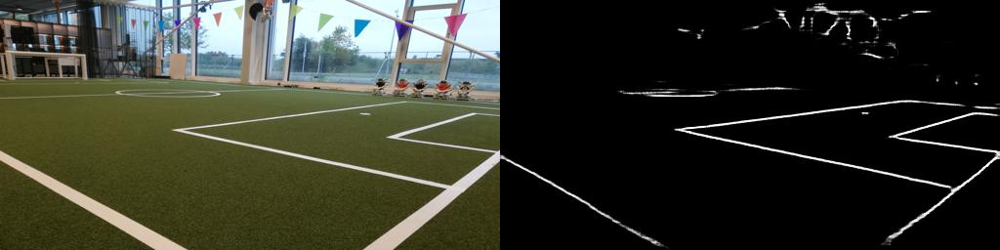

# This code is for soccer field marking detction using two conditional GANs.



Most of the code comes from: https://github.com/meng-tsai/soccer-line-detection
Which is based on the paper: "Sports Camera Calibration via Synthetic Data".

Link: https://arxiv.org/abs/1810.10658
```
@article{chen2018sports, 
  title={Sports Camera Calibration via Synthetic Data},   
  author={Chen, Jianhui and Little, James J},   
  journal={arXiv preprint arXiv:1810.10658},   
  year={2018}   
}
```

## Getting Started
### Installation
Code is tested on a conda environment on WSL2 Ubuntu 22.04.3 LTS.
There is a `environment.yml` for the conda environment. To load the environment run the following command (conda should be already installed):
```bash
conda env create -f environment.yml
```

### Prepare data:
The model training and testing do not receive the raw image but a concatenation of the image and the label (which is a segmentation or field lines). The training images need both a segmentation label and a field lines label (these will come in two seperate phases). The validation images only need the field lines.

#### Data annotation
If labels are not present, you can create them by drawing them by hand. This can be done with a very barebones browser app.
Input images will need to be supplied for the app. The location is specified below.The `train_phase_1` and `train_phase_2` need to receive the same input images.
```
├── data_annotation
│   ├── static
│   │   ├── images
│   │   │   ├── input
│   │   │   │   ├── <name_of_set>
│   │   │   │   │   ├── train_phase_1
│   │   │   │   │   ├── train_phase_2
│   │   │   │   │   ├── val
│   │   │   │   │   ├── test
```
To start it, run the following command in the `data_annotation` folder:

```bash
python app.py
```

#### Create training/testing data
The creation of the training and testing images can be done with the file `combine_A_and_B.py` in the `datasets` folder. An example:
```bash
python combine_A_and_B.py --fold_A ../data_annotation/static/images/input/custom_data_selection --fold_B ../data_annotation/static/images/annotated/custom_data_selection --fold_AB ./custom_data_selections\
```
The inputs are the original images `--fold_A`, and the labels `--fold_B`. The output folder is specified by `--fold_AB`.


### Model
The images intended for model training are located in the 'datasets' folder. Training the model requires three folders: `train_phase_1`, `train_phase_2`, and `val`. For model testing, images are sourced from the 'test' folder, and for prediction/generation, new images are placed in the 'generating' folder.
```
├── datasets
│   ├──<name_of_set>
│   │   ├── test                     # For testing
│   │   ├── train_phase_1            # For training
│   │   ├── train_phase_2            # For training
│   │   ├── val                      # For training
│   │   ├── generating               # For predicting/generating
```

#### Training:
For training you can run the train shell script. Make sure to specify the correct dataroot. The dataroot is the name of the folder your images are located e.g. `--dataroot ./datasets/custom_data_selection`
```bash
sh train.sh
```

#### Testing:

#### Predicting:
To predict the lines of a new image you can use the following shell script (make sure to specify the correct dataroot).
```bash
sh generate.sh
```

## Citation
If you use this code for your research, please cite our papers.
```
@inproceedings{CycleGAN2017,
  title={Unpaired Image-to-Image Translation using Cycle-Consistent Adversarial Networkss},
  author={Zhu, Jun-Yan and Park, Taesung and Isola, Phillip and Efros, Alexei A},
  booktitle={Computer Vision (ICCV), 2017 IEEE International Conference on},
  year={2017}
}

@inproceedings{isola2017image,
  title={Image-to-Image Translation with Conditional Adversarial Networks},
  author={Isola, Phillip and Zhu, Jun-Yan and Zhou, Tinghui and Efros, Alexei A},
  booktitle={Computer Vision and Pattern Recognition (CVPR), 2017 IEEE Conference on},
  year={2017}
}

```

## Acknowledgments
Code is inspired by https://github.com/meng-tsai/soccer-line-detection.
